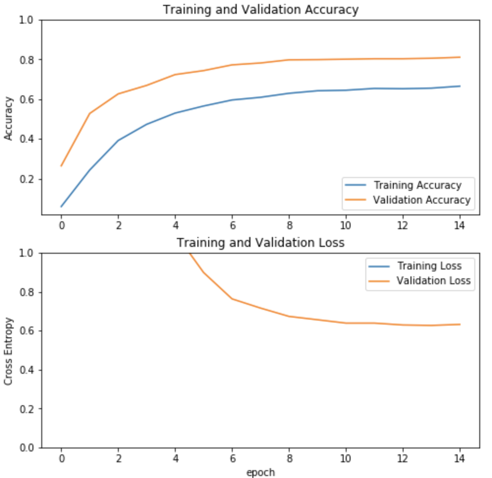

# Notebook recognizing dog breeds

AI project for EHB

Used dataset : http://vision.stanford.edu/aditya86/ImageNetDogs/
# Vanilla style model

Results with TFDS input pipeline (not ImageAugmentation),growing learning rate  and L2 regulizers

# Pretrained model with Xception

Results with ImageAugmentation,Earlystop, SGC optimizer and pretrained model (XCeption)

