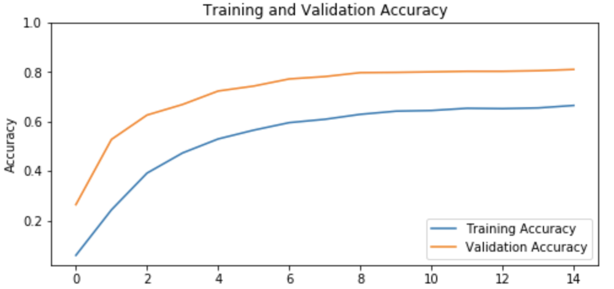

# Notebook recognizing dog breeds

AI project for EHB
Used dataset : http://vision.stanford.edu/aditya86/ImageNetDogs/

# Vanilla style model
Google Colab link : https://colab.research.google.com/drive/1L30hMMdIuD__ixe9zSdCLVazY20bVXT-
Results with TFDS input pipeline (not ImageAugmentation),growing learning rate  and L2 regulizers

Conclusion : less accuracy on validation, but faster than with ImageAugmentation

# Pretrained model with Xception
Google colab link : https://colab.research.google.com/drive/1BygqiMx4wWUztABjA-MYqCudxnP4UXaa
Results with ImageAugmentation,Earlystop, SGC optimizer and pretrained model (XCeption)

Conclusion : much slower because of old style input pipeline and Google Drive mounting but less training needed because of Xception
